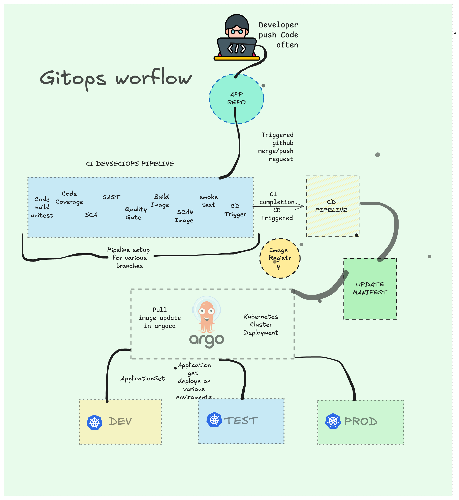

# GITOPS CONCEPT REPOS

This is the DevOps team's GitOps repository for Argo CD-based releases.
After the build pipeline runs, it updates manifest image tags to the latest successful build, and Argo CD applies those changes from Git.
This flow allows the team to control and choose exactly which build versions are released to each environment.

This repository stores Kubernetes GitOps configuration for deploying applications across multiple environments (`dev`, `staging`, `prod`).

## What this repo does

- Keeps Helm charts and environment-specific values in Git.
- Uses Argo CD `ApplicationSet` manifests to define automated deployments.
- Supports continuous sync behavior (`prune` and `selfHeal`) so cluster state matches Git state.
- Provides reusable deployment manifests, rollout examples, and setup guides.

## Main structure

- `apps/`
  - Helm charts for applications such as `springbook` and `healthcare`.
- `envs/`
  - Environment overrides (`dev`, `staging`, `prod`) used by charts.
- `argocd/`
  - Argo CD `ApplicationSet` definitions for multi-environment deployments.
- `rollouts/`
  - Canary/rollout sample manifests.
- `metallb/`
  - MetalLB configuration for service exposure.

## Typical GitOps flow

1. Update chart templates or environment values in this repo.
2. Commit and push changes.
3. Argo CD detects the changes and syncs target namespaces.
4. Kubernetes resources are reconciled automatically to the desired state from Git.

## Notes

- This repo is focused on deployment/configuration, not application source code.
- Treat this repository as the source of truth for cluster manifests and Helm values.
